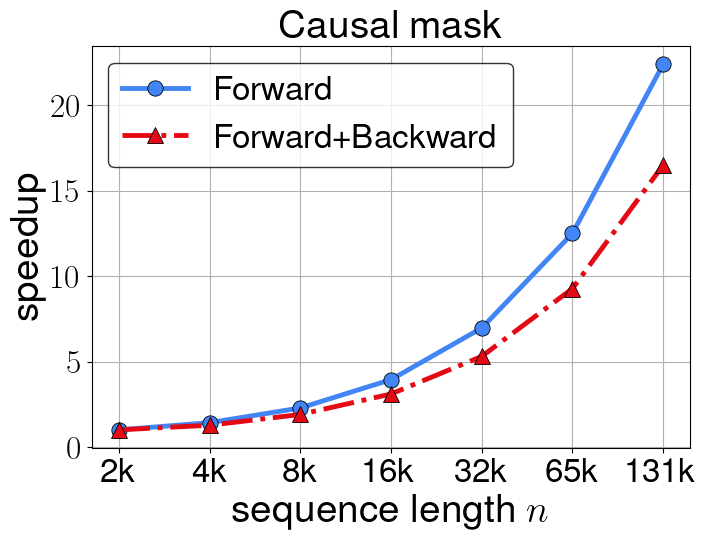
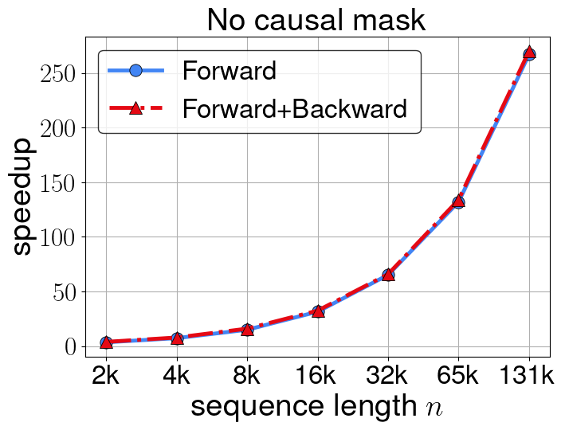

# HyperAttention: Long-context Attention in Near-Linear Time

Triton Implementation of HyperAttention Algorithm

# Requirements

The code requires ``pytorch`` and [``triton``](https://github.com/openai/triton).
pytorch version 2.0.1 tested, but any version >= 2.0.0 might work.
Also makes use of [triton](https://github.com/openai/triton) implementation of [FlashAttention](https://github.com/Dao-AILab/flash-attention/tree/main). Flash attention kernel adapted to be compilable with triton version **2.1.0.**

# How to use

The impelmentation of HyperAttention can be found in ``hyper_attention.py``. An example of usage:

```python
from hyper_attention import HyperAttention

attn = HyperAttention(
    input_dim=64, 
    lsh_num_projs=8,
    block_size=256,
    sample_size=256,
    min_seq_len=2048,
    smooth_block=False,)

attn_output = attn(query, key, value, causal=True)
```

The module has the following parameters:
- ```input_dim```: the dimension of input query and key. (Required)
- ```lsh_num_projs```: the number of random projection vectors used in the locality-sensitive hashing scheme. The default is 8.
- ```block_size```: the size of blocks for the block-diagonal approximation. The default is 256.
- ```sample_size```: the number of sampled columns in the attention matrix $A$. The default is 256.
- ```min_seq_len```: minimum sequence length that HyperAttention applies. When the sequence length is smaller than this value we compute exactly using the FlashAttention because overheads of HyperAttention may dominate the runtime for short sequences. The default value is ```2048```.
- ```smooth_block```: smoothen the block-diagonal approximation by letting the blocks overlap and resemble smooth banded diagonal approximation. The default is False.

# Speedup on single attention layer

In this section, we showcase the speedup achieved by HyperAttention in comparison to the Triton implementation of FlashAttention (v2) across a range of sequence lengths. The configuration involves 32 heads and a head_dim 64, and the results are obtained by running the methods on NVIDIA A10 Tensor Core GPUs.

## Causal masking (decoder-style attention)

The speedup factors for both the forward pass and forward+backward passes for the attention decoder with causal masking are plotted below. HyperAttention exhibits over a ```22x``` speedup for the forward pass and an over ```16x``` speedup for the combined forward+backward passes when the sequence length is ```131k```.

<p align="center">
    
</p>

## No causal masking (encoder-style attention)

The speedup factors for both the forward pass and forward+backward passes in the attention encoder, without causal masking, are shown below. HyperAttention reduces to a notably simpler and more efficient algorithm in the absence of causal masking, avoiding the need for recursive partitioning of the attention matrix.  Therefore, HyperAttention showcases remarkable speedups, surpassing ```270x``` acceleration for both the forward pass and the combined forward+backward passes when the sequence length is ```131k```.

<p align="center">
    
</p>
